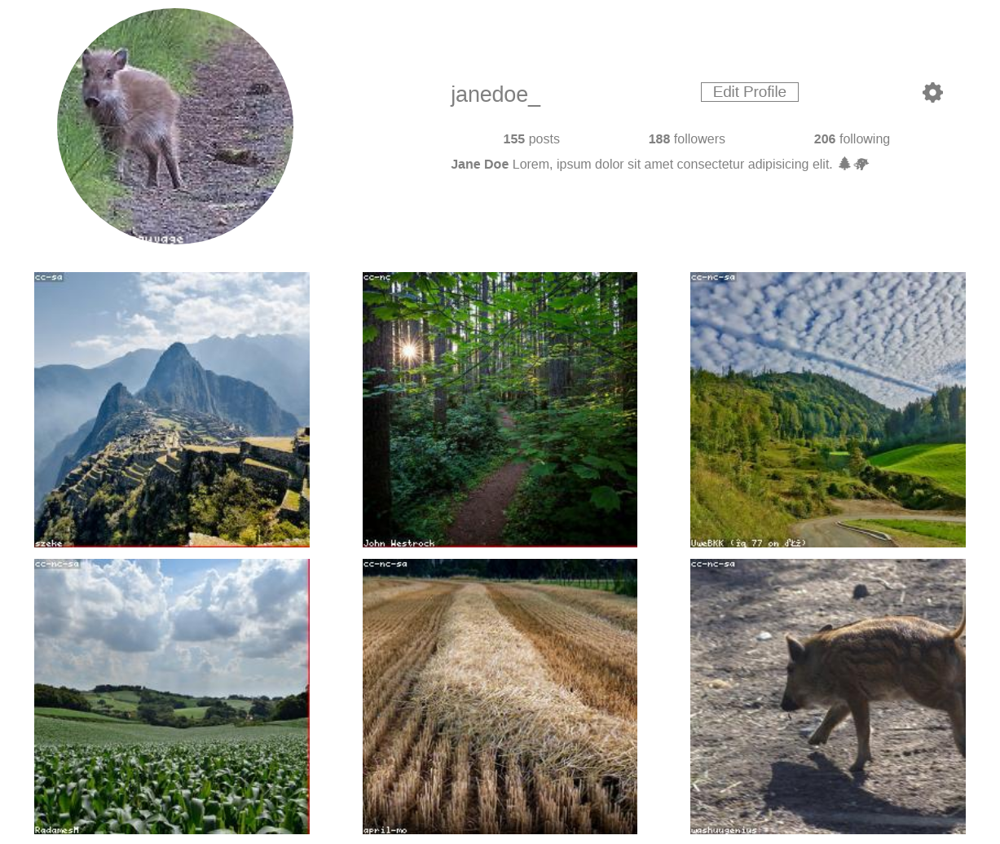
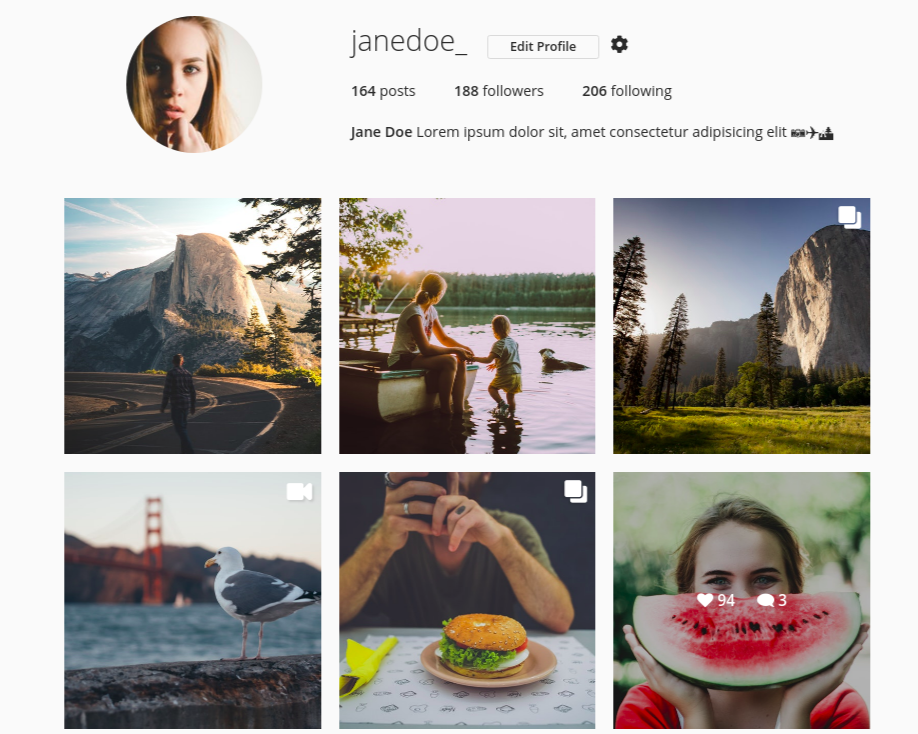
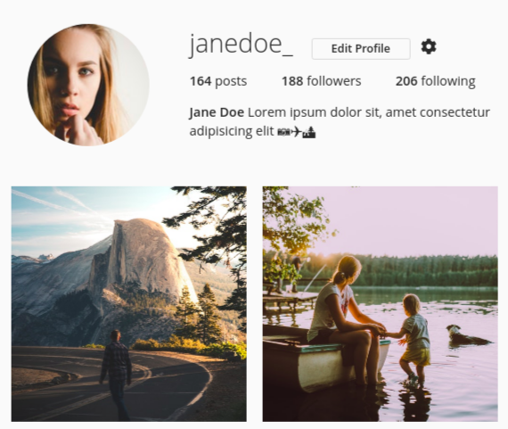

# Instagram Flexbox

This exercise was performed by Stefan Klinkusch at Digital Career Institute in Berlin, Germany using HTML and CSS.

## Features

It features
- a title section with a round profile image, profile description, and some statistical data
- six images in the collection which are shown in rows
	- rows of three images for the desktop version
	- rows of two images for the tablet version
	- rows of one single image for the mobile version

## Techniques
- Flexbox
- Fontawesome
- [LoremFlickr](https://loremflickr.com/)

## Screenshot



## Original Task

This is an exercise for Flexbox. You'll need to remember how to use the most common flexbox properties, to finish this exercise.

### Task

Create an instagram profile using **your own code** with **flexbox** and demo images from [LoremFlickr](https://loremflickr.com/).

Example of landscape images in a square size:

```
https://loremflickr.com/500/500/nature,landscape/all
```


### Mockups

Look at all three expected layouts, **before** you start.

#### Desktop



#### Tablet



#### Mobile


